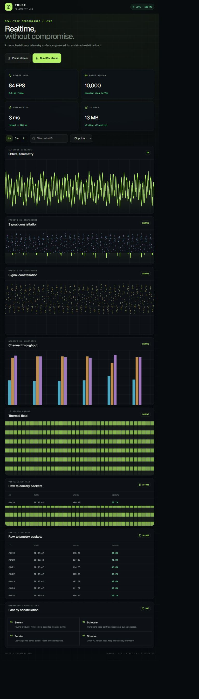
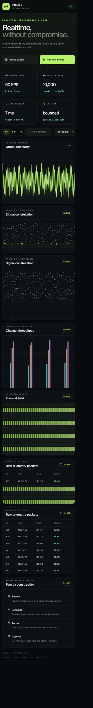

# Pulse Telemetry Lab

> A performance-first, real-time telemetry dashboard built for Flam's Frontend R&D assignment.

Pulse renders line, scatter, bar, and heatmap visualizations from one bounded data stream. Every dense visualization is drawn directly on Canvas, keeping React focused on application state and accessible controls—not individual pixels.



## Why Pulse stands out

- **10,000 live points by default** with a one-click **50,000-point stress mode**
- **Zero chart-library rendering** across four custom Canvas visualizations
- **High-DPI and responsive** output with device-pixel-ratio capping
- **Smooth interaction** through wheel zoom, pointer pan, aggregation, and packet filtering
- **A bounded mutable stream buffer** that avoids copying tens of thousands of objects every 100 ms
- **A virtualized telemetry table** that keeps the mounted DOM nearly constant
- **Built-in performance evidence** through FPS, frame cost, interaction latency, and heap readouts
- **Production states included**: responsive layout, semantic controls, loading UI, and error boundary

## Responsive experience

The same dense telemetry surface adapts cleanly to narrow screens without sacrificing controls or data visibility.

<p align="center">
  
</p>

## Architecture

```text
/api/data ──> bounded stream buffer ──> scheduled UI notification
                         │
                         ├──> Canvas renderers (dense pixels)
                         ├──> performance observers (FPS / latency / heap)
                         └──> virtualized table (visible rows only)
```

The App Router page provides a Server Component shell around an explicitly isolated Client Component. Stream notifications are scheduled with `startTransition`, while mutable data remains outside React's render cycle. Each Canvas renderer samples relative to its pixel width, which keeps drawing cost predictable as the stream grows.

## Visualization suite

| View | Purpose | Rendering strategy |
| --- | --- | --- |
| Orbital telemetry | Inspect continuous altitude variance | Level-of-detail line sampling |
| Signal constellation | Compare packet confidence over time | Batched scatter drawing |
| Channel throughput | Compare grouped subsystem output | Direct Canvas bars |
| Thermal field | Scan sensor arrays for hotspots | Cell-based heatmap |

All views use the same source stream. No D3, Chart.js, Recharts, or other charting library is used for visualization rendering.

## Run locally

Requires **Node.js 20.19+**.

```bash
git clone https://github.com/asifa1510/flamm.git
cd flamm
npm install
npm run dev
```

Open [http://localhost:3000](http://localhost:3000).

For a production build:

```bash
npm run build
npm start
```

## API

The dashboard includes an App Router route handler for generating an initial telemetry payload:

```http
GET /api/data?count=10000
```

`count` is validated and capped to keep requests bounded.

## Deploy to Render

This repository includes a ready-to-use [`render.yaml`](render.yaml) Blueprint.

1. Push the project to GitHub.
2. In Render, choose **New → Blueprint**.
3. Connect this repository and apply the detected configuration.
4. Render will run `npm ci && npm run build`, then start the production server.

[**Deploy this repository on Render →**](https://render.com/deploy?repo=https://github.com/asifa1510/flamm)

## Performance verification

1. Start a production build and open Chrome DevTools Performance Monitor.
2. Leave the 10k stream running for two minutes and observe the in-app FPS counter.
3. Enable **50k stress**, then zoom, pan, change aggregation, and filter packet IDs.
4. Scroll through the telemetry table and verify that its DOM-node count stays nearly flat.
5. Compare heap snapshots before and after an extended run; the bounded buffer prevents unbounded growth.

More implementation detail is available in [`PERFORMANCE.md`](PERFORMANCE.md).

## Browser support

Pulse supports current Chrome, Edge, Firefox, and Safari. `performance.memory` is Chromium-only; other browsers report the heap as **bounded** while continuing to display FPS, frame cost, and interaction latency.

## Tech stack

- Next.js App Router
- React 19
- TypeScript
- HTML Canvas 2D
- Tailwind CSS

---

Built as an exploration of how far the browser can be pushed while keeping the interface responsive, inspectable, and accessible.
